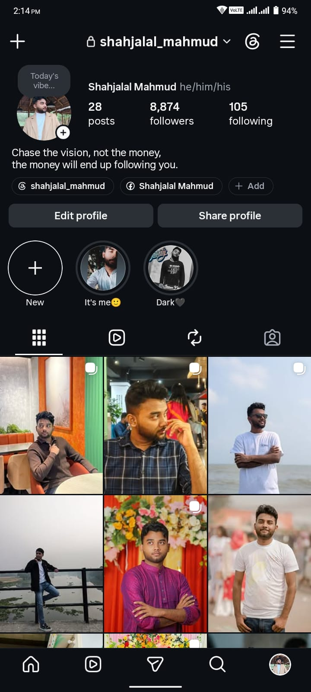
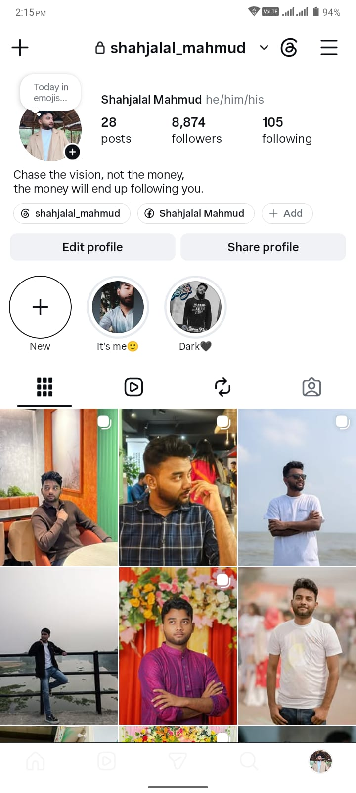
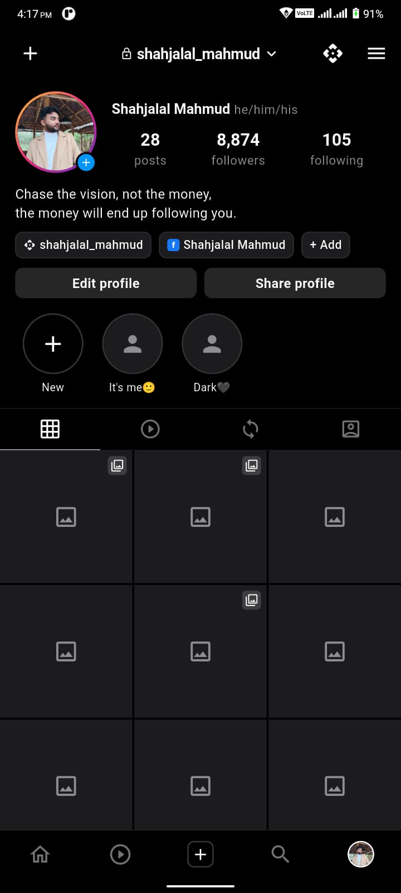
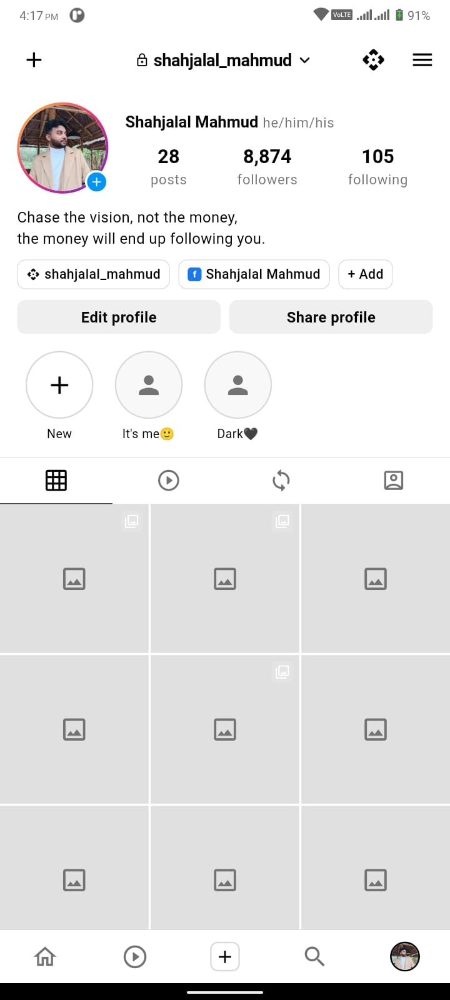

#  Instagram Profile Screen — Flutter UI Clone

> **Module 2 · Class 2 Assignment**
> National Android Development Bootcamp by **BDApps & Ostad**

A pixel-perfect Flutter UI clone of the **Instagram profile screen** built as a frontend-only assignment project.
The goal is to practice responsive layouts, reusable widget architecture, Material 3 theming, and modern mobile UI design principles — with full **Light Mode** and **Dark Mode** support.

---

## 📱 Project Overview

This assignment replicates the real Instagram profile screen of **@shahjalal_mahmud**, matching every detail:
top app bar, profile stats, bio, story highlights, posts grid, tab bar, and bottom navigation — all in Flutter, with no backend or authentication.

The focus is entirely on:

✅ Pixel-perfect UI replication
✅ Clean, reusable widget architecture
✅ Light Mode & Dark Mode theming
✅ Responsive & scrollable layout
✅ Modern Flutter best practices

---

## 📸 Screenshots

### 🎯 Reference UI — Real Instagram App

| Dark Mode                                                      | Light Mode                                                       |
|----------------------------------------------------------------|------------------------------------------------------------------|
|  |  |

---

### 📱 Flutter Assignment Output

| Dark Mode                                                  | Light Mode                                                   |
|------------------------------------------------------------|--------------------------------------------------------------|
|  |  |

---

## ✨ Features

### 🎨 UI Components Replicated

| Component            | Description                                                    |
|----------------------|----------------------------------------------------------------|
| **Top App Bar**      | Lock icon + username + dropdown arrow, Threads icon, Menu icon |
| **Profile Header**   | Circular avatar with story ring gradient and `+` badge         |
| **Profile Stats**    | Posts · Followers · Following counts in bold                   |
| **Bio Section**      | Multiline bio text                                             |
| **Action Chips**     | Threads username chip, Facebook profile chip, Add chip         |
| **Profile Buttons**  | Edit profile + Share profile — identical to Instagram's style  |
| **Story Highlights** | Horizontally scrollable highlights with New `+` button         |
| **Tab Bar**          | Grid · Reels · Collab · Tagged tabs with active underline      |
| **Posts Grid**       | 3-column square image grid with multi-photo indicator icons    |
| **Bottom Nav Bar**   | Home · Reels · Add · Search · Profile — Profile tab selected   |

### 🌗 Theming
- Full **Light Mode** — white background, dark text
- Full **Dark Mode** — black background, white text
- `ThemeMode.system` — automatically follows device preference
- Instagram-accurate color tokens for both themes

---

## 🧩 Flutter Concepts Used

- Stateless & Stateful Widgets
- `CustomScrollView` with Slivers (`SliverAppBar`, `SliverGrid`, `SliverToBoxAdapter`)
- `Column`, `Row`, `Stack`, `Positioned`
- `ListView` (horizontal highlights scroll)
- `ClipOval` for circular images
- `Material 3` with custom `ThemeData`
- `ColorScheme` for light/dark theming
- `MediaQuery` & `SafeArea` for responsiveness
- `const` constructors throughout for performance
- Asset management (`pubspec.yaml` configuration)

---

## 🗂 Project Structure

```
lib/
│
├── main.dart                               # App entry point, ThemeMode.system
│
├── core/
│   ├── constants/
│   │   ├── app_colors.dart                 # All color tokens — dark & light
│   │   ├── app_sizes.dart                  # Spacing, radii, font sizes
│   │   └── app_strings.dart                # All text & label constants
│   └── theme/
│       └── app_theme.dart                  # Light & Dark ThemeData
│
├── data/
│   └── models/
│       ├── highlight_model.dart            # HighlightModel + dummy data
│       └── post_model.dart                 # PostModel + dummy data
│
├── presentation/
│   ├── screens/
│   │   └── instagram_profile_screen.dart  # Main screen — Sliver-based scroll
│   └── widgets/
│       ├── profile_header.dart            # Avatar + name + pronouns
│       ├── profile_stats.dart             # Posts / Followers / Following
│       ├── profile_bio.dart               # Bio text
│       ├── action_chip.dart               # Threads / Facebook / Add chips
│       ├── profile_buttons.dart           # Edit profile + Share profile
│       ├── highlights_section.dart        # Horizontal scroll highlights row
│       ├── highlight_item.dart            # Single highlight circle + label
│       ├── profile_tabs.dart              # Tab bar with active indicator
│       ├── posts_grid.dart                # SliverGrid of posts
│       ├── post_item.dart                 # Single post tile with overlay icon
│       └── bottom_nav_bar.dart            # 5-item bottom navigation bar
│
assets/
├── images/                                # profile.jpg · post_*.jpg · highlight_*.jpg
├── icons/                                 # Reserved for custom SVG icons
└── screenshots/                           # Reference & output screenshots
```

---

## 🚀 Getting Started

### Prerequisites

Make sure you have these installed:

- Flutter SDK (3.x or above)
- Dart SDK
- Android Studio or VS Code
- Android Emulator or Physical Device

---

### 🔧 Installation

**1. Clone the repository**

```bash
git clone <your-repository-link>
cd instagram_profile
```

**2. Install dependencies**

```bash
flutter pub get
```

**3. Add your photos** *(optional — placeholder images are already included)*

Replace the images in `assets/images/` with your own:

| File                        | Purpose                               |
|-----------------------------|---------------------------------------|
| `profile.jpg`               | Profile picture (header + bottom nav) |
| `highlight_itsme.jpg`       | "It's me 🙂" highlight cover          |
| `highlight_dark.jpg`        | "Dark 🖤" highlight cover             |
| `post_1.jpg` → `post_9.jpg` | Posts grid images                     |

**4. Run the app**

```bash
flutter run
```

---

### 🌗 Switching Theme Mode

The app follows system appearance by default. To force a theme during development, edit `main.dart`:

```dart
themeMode: ThemeMode.dark,    // Force dark mode
themeMode: ThemeMode.light,   // Force light mode
themeMode: ThemeMode.system,  // Follow device setting (default)
```

---

## 🛠️ Tech Stack

| Technology               | Usage                   |
|--------------------------|-------------------------|
| Flutter 3.x              | UI Development          |
| Dart 3.x                 | Programming Language    |
| Material Design 3        | UI Components & Theming |
| Android Studio / VS Code | Development Environment |

> ⚡ Zero third-party packages — built entirely with Flutter's built-in widgets.

---

## ✅ Code Quality Highlights

- `const` constructors used everywhere for rebuild performance
- No magic numbers — all sizes/colors/strings live in `core/constants/`
- `SliverGrid` + `SliverAppBar` for smooth, jank-free unified scrolling
- `errorBuilder` fallback on every `Image.asset` call — app never crashes on missing assets
- Theme-aware colors via `Theme.of(context).brightness` throughout
- Clean separation: models → widgets → screen — nothing dumped into `main.dart`

---

## 🎯 Assignment Objective

The main objective of this assignment is to:

- Practice Flutter UI development
- Understand widget tree structure and layout building
- Learn responsive mobile design principles
- Build and organize reusable widget components
- Replicate real-world application interfaces accurately

---

## 🧠 What I Learned

Through this assignment I practiced and improved my understanding of:

- Flutter's Sliver-based scroll system (`CustomScrollView`, `SliverGrid`, `SliverAppBar`)
- Building clean architecture without overengineering
- Material 3 `ThemeData` and `ColorScheme` for proper dark/light support
- Separating concerns: constants · models · widgets · screens
- Handling responsive layouts with `SafeArea` and `MediaQuery`
- Managing complex nested widgets while keeping code readable

---

## 📌 Future Improvements

Although this assignment only requires frontend UI, future enhancements may include:

- Navigation between multiple profile screens (Instagram, Facebook, LinkedIn, GitHub)
- Animated story highlight ring
- Smooth page transitions
- Firebase Authentication & real user data
- Dynamic post loading from an API

---

## 👨‍💻 Developed By

### Md Shahajalal Mahmud

Flutter Learner · Android Developer · UI Enthusiast

**Instagram:** [@shahjalal_mahmud](https://instagram.com/shahjalal_mahmud)

---

### Bootcamp

**National Android Development Bootcamp**
by **BDApps & Ostad**

---

## 🙏 Acknowledgements

Special thanks to:

- **BDApps** — for organizing this bootcamp
- **Ostad Platform** — for the learning infrastructure
- **Course Mentor & Instructors** — for guidance and feedback
- **Flutter Community** — for incredible documentation and resources

---

## 📄 License

This project is created for **educational and assignment purposes only.**
The UI design is inspired by Instagram, a product of Meta Platforms, Inc.
All respective trademarks and copyrights belong to their original owners.

---

> ⭐ *This project represents my hands-on learning journey in Flutter UI development through the National Android Development Bootcamp.*